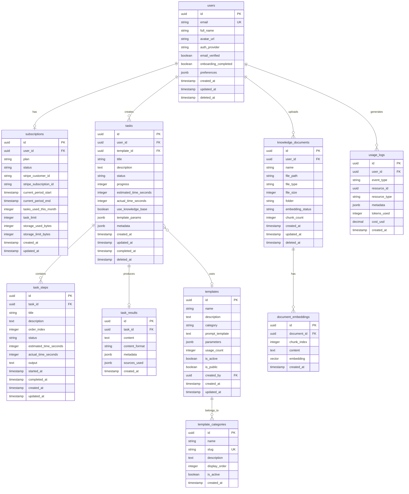

# Database Schema for TaskPilot

**Version:** 1.0  
**Date:** February 24, 2026  
**Status:** Final  
**Database Engine:** PostgreSQL 15 via Supabase

---

## Scope and Purpose

Схема базы данных для TaskPilot — AI SaaS-платформы делегирования бизнес-задач. Охватывает управление пользователями, задачами, шаблонами, базой знаний и биллингом.

## Chosen Database Engine

**PostgreSQL 15** (через Supabase)

**Обоснование:**
- Встроенная поддержка Row Level Security (RLS)
- pgvector для хранения эмбеддингов
- Realtime подписки через Supabase
- Интеграция с Supabase Auth
- JSONB для гибких метаданных

---

## Conceptual Model (ER-диаграмма)



---

## Logical Model (Детальное описание таблиц)

### Table: users

**Purpose:** Профили пользователей платформы. Связана с Supabase Auth через `auth.users.id`.

```sql
CREATE TABLE public.users (
    id UUID PRIMARY KEY REFERENCES auth.users(id) ON DELETE CASCADE,
    email VARCHAR(255) NOT NULL UNIQUE,
    full_name VARCHAR(100),
    avatar_url VARCHAR(500),
    auth_provider VARCHAR(20) NOT NULL DEFAULT 'email',
    email_verified BOOLEAN NOT NULL DEFAULT FALSE,
    onboarding_completed BOOLEAN NOT NULL DEFAULT FALSE,
    preferences JSONB DEFAULT '{}',
    created_at TIMESTAMPTZ NOT NULL DEFAULT NOW(),
    updated_at TIMESTAMPTZ NOT NULL DEFAULT NOW(),
    last_login_at TIMESTAMPTZ,
    deleted_at TIMESTAMPTZ
);

-- Indexes
CREATE INDEX idx_users_email ON public.users(email);
CREATE INDEX idx_users_created_at ON public.users(created_at);
CREATE INDEX idx_users_deleted_at ON public.users(deleted_at) WHERE deleted_at IS NULL;

-- Constraints
ALTER TABLE public.users ADD CONSTRAINT chk_users_auth_provider 
    CHECK (auth_provider IN ('email', 'google', 'github'));

-- Updated_at trigger
CREATE TRIGGER set_users_updated_at
    BEFORE UPDATE ON public.users
    FOR EACH ROW
    EXECUTE FUNCTION public.set_updated_at();
```

**Columns:**
| Column | Type | Constraints | Default | Description |
|--------|------|-------------|---------|-------------|
| id | UUID | PK, FK → auth.users | - | Связь с Supabase Auth |
| email | VARCHAR(255) | NOT NULL, UNIQUE | - | Email пользователя |
| full_name | VARCHAR(100) | - | NULL | Полное имя |
| avatar_url | VARCHAR(500) | - | NULL | URL аватара |
| auth_provider | VARCHAR(20) | NOT NULL | 'email' | Провайдер: email, google, github |
| email_verified | BOOLEAN | NOT NULL | FALSE | Email подтверждён |
| onboarding_completed | BOOLEAN | NOT NULL | FALSE | Онбординг завершён |
| preferences | JSONB | - | '{}' | Пользовательские настройки |
| created_at | TIMESTAMPTZ | NOT NULL | NOW() | Дата создания |
| updated_at | TIMESTAMPTZ | NOT NULL | NOW() | Дата обновления |
| last_login_at | TIMESTAMPTZ | - | NULL | Последний вход |
| deleted_at | TIMESTAMPTZ | - | NULL | Soft delete |

**Business Rules:**
- `auth_provider` принимает только: 'email', 'google', 'github'
- `id` связан с `auth.users.id` через ON DELETE CASCADE
- Soft delete через `deleted_at`

---

### Table: subscriptions

**Purpose:** Управление подписками и биллингом. Один пользователь — одна активная подписка.

```sql
CREATE TABLE public.subscriptions (
    id UUID PRIMARY KEY DEFAULT gen_random_uuid(),
    user_id UUID NOT NULL REFERENCES public.users(id) ON DELETE CASCADE,
    plan VARCHAR(20) NOT NULL DEFAULT 'free',
    status VARCHAR(20) NOT NULL DEFAULT 'active',
    stripe_customer_id VARCHAR(100),
    stripe_subscription_id VARCHAR(100),
    current_period_start TIMESTAMPTZ,
    current_period_end TIMESTAMPTZ,
    tasks_used_this_month INTEGER NOT NULL DEFAULT 0,
    task_limit INTEGER NOT NULL DEFAULT 5,
    storage_used_bytes BIGINT NOT NULL DEFAULT 0,
    storage_limit_bytes BIGINT NOT NULL DEFAULT 104857600,
    created_at TIMESTAMPTZ NOT NULL DEFAULT NOW(),
    updated_at TIMESTAMPTZ NOT NULL DEFAULT NOW(),
    
    CONSTRAINT uq_subscriptions_user_id UNIQUE(user_id)
);

-- Indexes
CREATE INDEX idx_subscriptions_user_id ON public.subscriptions(user_id);
CREATE INDEX idx_subscriptions_status ON public.subscriptions(status);
CREATE INDEX idx_subscriptions_stripe_customer_id ON public.subscriptions(stripe_customer_id) 
    WHERE stripe_customer_id IS NOT NULL;
CREATE INDEX idx_subscriptions_current_period_end ON public.subscriptions(current_period_end);

-- Constraints
ALTER TABLE public.subscriptions ADD CONSTRAINT chk_subscriptions_plan 
    CHECK (plan IN ('free', 'pro', 'business'));
ALTER TABLE public.subscriptions ADD CONSTRAINT chk_subscriptions_status 
    CHECK (status IN ('active', 'canceled', 'past_due', 'trialing', 'paused'));
ALTER TABLE public.subscriptions ADD CONSTRAINT chk_subscriptions_tasks_used 
    CHECK (tasks_used_this_month >= 0);
ALTER TABLE public.subscriptions ADD CONSTRAINT chk_subscriptions_task_limit 
    CHECK (task_limit > 0);

-- Trigger
CREATE TRIGGER set_subscriptions_updated_at
    BEFORE UPDATE ON public.subscriptions
    FOR EACH ROW
    EXECUTE FUNCTION public.set_updated_at();
```

**Columns:**
| Column | Type | Constraints | Default | Description |
|--------|------|-------------|---------|-------------|
| id | UUID | PK | gen_random_uuid() | Идентификатор |
| user_id | UUID | NOT NULL, FK, UNIQUE | - | Владелец подписки |
| plan | VARCHAR(20) | NOT NULL | 'free' | План: free, pro, business |
| status | VARCHAR(20) | NOT NULL | 'active' | Статус подписки |
| stripe_customer_id | VARCHAR(100) | - | NULL | Stripe Customer ID |
| stripe_subscription_id | VARCHAR(100) | - | NULL | Stripe Subscription ID |
| current_period_start | TIMESTAMPTZ | - | NULL | Начало периода |
| current_period_end | TIMESTAMPTZ | - | NULL | Конец периода |
| tasks_used_this_month | INTEGER | NOT NULL | 0 | Использовано задач |
| task_limit | INTEGER | NOT NULL | 5 | Лимит задач |
| storage_used_bytes | BIGINT | NOT NULL | 0 | Использовано хранилища |
| storage_limit_bytes | BIGINT | NOT NULL | 104857600 | Лимит хранилища (100MB) |
| created_at | TIMESTAMPTZ | NOT NULL | NOW() | Дата создания |
| updated_at | TIMESTAMPTZ | NOT NULL | NOW() | Дата обновления |

**Business Rules:**
- Лимиты по планам: Free=5 задач/100MB, Pro=50 задач/1GB, Business=200 задач/10GB
- `tasks_used_this_month` сбрасывается в начале периода
- Один активный subscription на пользователя

---

### Table: tasks

**Purpose:** Задачи, делегированные пользователями. Центральная сущность системы.

```sql
CREATE TABLE public.tasks (
    id UUID PRIMARY KEY DEFAULT gen_random_uuid(),
    user_id UUID NOT NULL REFERENCES public.users(id) ON DELETE CASCADE,
    template_id UUID REFERENCES public.templates(id) ON DELETE SET NULL,
    title VARCHAR(200) NOT NULL,
    description TEXT NOT NULL,
    status VARCHAR(20) NOT NULL DEFAULT 'pending',
    progress INTEGER NOT NULL DEFAULT 0,
    estimated_time_seconds INTEGER,
    actual_time_seconds INTEGER,
    use_knowledge_base BOOLEAN NOT NULL DEFAULT TRUE,
    template_params JSONB,
    metadata JSONB DEFAULT '{}',
    created_at TIMESTAMPTZ NOT NULL DEFAULT NOW(),
    updated_at TIMESTAMPTZ NOT NULL DEFAULT NOW(),
    started_at TIMESTAMPTZ,
    completed_at TIMESTAMPTZ,
    deleted_at TIMESTAMPTZ,
    
    CONSTRAINT chk_tasks_progress CHECK (progress >= 0 AND progress <= 100),
    CONSTRAINT chk_tasks_description_length CHECK (char_length(description) >= 10 AND char_length(description) <= 2000)
);

-- Indexes
CREATE INDEX idx_tasks_user_id ON public.tasks(user_id);
CREATE INDEX idx_tasks_user_id_status ON public.tasks(user_id, status);
CREATE INDEX idx_tasks_status ON public.tasks(status);
CREATE INDEX idx_tasks_template_id ON public.tasks(template_id) WHERE template_id IS NOT NULL;
CREATE INDEX idx_tasks_created_at ON public.tasks(created_at DESC);
CREATE INDEX idx_tasks_user_created ON public.tasks(user_id, created_at DESC);
CREATE INDEX idx_tasks_deleted_at ON public.tasks(deleted_at) WHERE deleted_at IS NULL;

-- Status constraint
ALTER TABLE public.tasks ADD CONSTRAINT chk_tasks_status 
    CHECK (status IN ('pending', 'decomposing', 'executing', 'paused', 'completed', 'failed', 'canceled'));

-- Trigger
CREATE TRIGGER set_tasks_updated_at
    BEFORE UPDATE ON public.tasks
    FOR EACH ROW
    EXECUTE FUNCTION public.set_updated_at();
```

**Columns:**
| Column | Type | Constraints | Default | Description |
|--------|------|-------------|---------|-------------|
| id | UUID | PK | gen_random_uuid() | Идентификатор задачи |
| user_id | UUID | NOT NULL, FK | - | Владелец задачи |
| template_id | UUID | FK | NULL | Используемый шаблон |
| title | VARCHAR(200) | NOT NULL | - | Заголовок задачи |
| description | TEXT | NOT NULL, 10-2000 chars | - | Описание задачи |
| status | VARCHAR(20) | NOT NULL | 'pending' | Статус выполнения |
| progress | INTEGER | NOT NULL, 0-100 | 0 | Прогресс (%) |
| estimated_time_seconds | INTEGER | - | NULL | Оценка времени |
| actual_time_seconds | INTEGER | - | NULL | Фактическое время |
| use_knowledge_base | BOOLEAN | NOT NULL | TRUE | Использовать базу знаний |
| template_params | JSONB | - | NULL | Параметры шаблона |
| metadata | JSONB | - | '{}' | Дополнительные метаданные |
| created_at | TIMESTAMPTZ | NOT NULL | NOW() | Дата создания |
| updated_at | TIMESTAMPTZ | NOT NULL | NOW() | Дата обновления |
| started_at | TIMESTAMPTZ | - | NULL | Начало выполнения |
| completed_at | TIMESTAMPTZ | - | NULL | Завершение |
| deleted_at | TIMESTAMPTZ | - | NULL | Soft delete |

**Status Flow:**
```
pending → decomposing → executing → completed
                    ↓           ↓
                 failed      paused → executing
                    ↓           ↓
                canceled    canceled
```

**Business Rules:**
- Описание: 10-2000 символов
- Progress: 0-100%
- Soft delete через `deleted_at`
- При удалении шаблона `template_id` становится NULL

---

### Table: task_steps

**Purpose:** Шаги (подзадачи) выполнения основной задачи. Создаются при декомпозиции.

```sql
CREATE TABLE public.task_steps (
    id UUID PRIMARY KEY DEFAULT gen_random_uuid(),
    task_id UUID NOT NULL REFERENCES public.tasks(id) ON DELETE CASCADE,
    title VARCHAR(200) NOT NULL,
    description TEXT,
    order_index INTEGER NOT NULL,
    status VARCHAR(20) NOT NULL DEFAULT 'pending',
    estimated_time_seconds INTEGER,
    actual_time_seconds INTEGER,
    output TEXT,
    error_message TEXT,
    started_at TIMESTAMPTZ,
    completed_at TIMESTAMPTZ,
    created_at TIMESTAMPTZ NOT NULL DEFAULT NOW(),
    updated_at TIMESTAMPTZ NOT NULL DEFAULT NOW(),
    
    CONSTRAINT uq_task_steps_task_order UNIQUE(task_id, order_index)
);

-- Indexes
CREATE INDEX idx_task_steps_task_id ON public.task_steps(task_id);
CREATE INDEX idx_task_steps_task_status ON public.task_steps(task_id, status);
CREATE INDEX idx_task_steps_status ON public.task_steps(status);

-- Status constraint
ALTER TABLE public.task_steps ADD CONSTRAINT chk_task_steps_status 
    CHECK (status IN ('pending', 'in_progress', 'completed', 'failed', 'skipped'));

-- Order constraint
ALTER TABLE public.task_steps ADD CONSTRAINT chk_task_steps_order 
    CHECK (order_index >= 0);

-- Trigger
CREATE TRIGGER set_task_steps_updated_at
    BEFORE UPDATE ON public.task_steps
    FOR EACH ROW
    EXECUTE FUNCTION public.set_updated_at();
```

**Columns:**
| Column | Type | Constraints | Default | Description |
|--------|------|-------------|---------|-------------|
| id | UUID | PK | gen_random_uuid() | Идентификатор шага |
| task_id | UUID | NOT NULL, FK | - | Родительская задача |
| title | VARCHAR(200) | NOT NULL | - | Название шага |
| description | TEXT | - | NULL | Описание шага |
| order_index | INTEGER | NOT NULL, UNIQUE(task_id) | - | Порядковый номер |
| status | VARCHAR(20) | NOT NULL | 'pending' | Статус шага |
| estimated_time_seconds | INTEGER | - | NULL | Оценка времени |
| actual_time_seconds | INTEGER | - | NULL | Фактическое время |
| output | TEXT | - | NULL | Результат шага |
| error_message | TEXT | - | NULL | Сообщение об ошибке |
| started_at | TIMESTAMPTZ | - | NULL | Начало |
| completed_at | TIMESTAMPTZ | - | NULL | Завершение |
| created_at | TIMESTAMPTZ | NOT NULL | NOW() | Дата создания |
| updated_at | TIMESTAMPTZ | NOT NULL | NOW() | Дата обновления |

**Business Rules:**
- `order_index` уникален в рамках задачи
- Типичная задача содержит 3-7 шагов
- При удалении задачи шаги удаляются каскадно

---

### Table: task_results

**Purpose:** Итоговые результаты выполненных задач.

```sql
CREATE TABLE public.task_results (
    id UUID PRIMARY KEY DEFAULT gen_random_uuid(),
    task_id UUID NOT NULL REFERENCES public.tasks(id) ON DELETE CASCADE,
    content TEXT NOT NULL,
    content_format VARCHAR(20) NOT NULL DEFAULT 'markdown',
    metadata JSONB DEFAULT '{}',
    sources_used JSONB DEFAULT '[]',
    tokens_input INTEGER,
    tokens_output INTEGER,
    created_at TIMESTAMPTZ NOT NULL DEFAULT NOW(),
    
    CONSTRAINT uq_task_results_task_id UNIQUE(task_id)
);

-- Indexes
CREATE INDEX idx_task_results_task_id ON public.task_results(task_id);
CREATE INDEX idx_task_results_created_at ON public.task_results(created_at DESC);

-- Format constraint
ALTER TABLE public.task_results ADD CONSTRAINT chk_task_results_format 
    CHECK (content_format IN ('markdown', 'html', 'plain'));
```

**Columns:**
| Column | Type | Constraints | Default | Description |
|--------|------|-------------|---------|-------------|
| id | UUID | PK | gen_random_uuid() | Идентификатор |
| task_id | UUID | NOT NULL, FK, UNIQUE | - | Связанная задача |
| content | TEXT | NOT NULL | - | Содержимое результата |
| content_format | VARCHAR(20) | NOT NULL | 'markdown' | Формат контента |
| metadata | JSONB | - | '{}' | Метаданные |
| sources_used | JSONB | - | '[]' | Использованные источники |
| tokens_input | INTEGER | - | NULL | Входные токены |
| tokens_output | INTEGER | - | NULL | Выходные токены |
| created_at | TIMESTAMPTZ | NOT NULL | NOW() | Дата создания |

**Business Rules:**
- Одна задача — один результат
- При удалении задачи результат удаляется

---

### Table: templates

**Purpose:** Библиотека шаблонов задач с параметрами.

```sql
CREATE TABLE public.templates (
    id UUID PRIMARY KEY DEFAULT gen_random_uuid(),
    name VARCHAR(100) NOT NULL,
    description TEXT,
    category VARCHAR(50) NOT NULL,
    prompt_template TEXT NOT NULL,
    parameters JSONB NOT NULL DEFAULT '[]',
    example_output TEXT,
    usage_count INTEGER NOT NULL DEFAULT 0,
    avg_rating DECIMAL(3,2),
    is_active BOOLEAN NOT NULL DEFAULT TRUE,
    is_public BOOLEAN NOT NULL DEFAULT TRUE,
    created_by UUID REFERENCES public.users(id) ON DELETE SET NULL,
    created_at TIMESTAMPTZ NOT NULL DEFAULT NOW(),
    updated_at TIMESTAMPTZ NOT NULL DEFAULT NOW()
);

-- Indexes
CREATE INDEX idx_templates_category ON public.templates(category);
CREATE INDEX idx_templates_is_active ON public.templates(is_active) WHERE is_active = TRUE;
CREATE INDEX idx_templates_usage_count ON public.templates(usage_count DESC);
CREATE INDEX idx_templates_created_by ON public.templates(created_by) WHERE created_by IS NOT NULL;
CREATE INDEX idx_templates_name_search ON public.templates USING gin(to_tsvector('english', name || ' ' || COALESCE(description, '')));

-- Constraints
ALTER TABLE public.templates ADD CONSTRAINT chk_templates_category 
    CHECK (category IN ('research', 'content', 'email', 'data_analysis', 'social_media', 'seo', 'other'));
ALTER TABLE public.templates ADD CONSTRAINT chk_templates_usage_count 
    CHECK (usage_count >= 0);
ALTER TABLE public.templates ADD CONSTRAINT chk_templates_rating 
    CHECK (avg_rating IS NULL OR (avg_rating >= 1 AND avg_rating <= 5));

-- Trigger
CREATE TRIGGER set_templates_updated_at
    BEFORE UPDATE ON public.templates
    FOR EACH ROW
    EXECUTE FUNCTION public.set_updated_at();
```

**Columns:**
| Column | Type | Constraints | Default | Description |
|--------|------|-------------|---------|-------------|
| id | UUID | PK | gen_random_uuid() | Идентификатор |
| name | VARCHAR(100) | NOT NULL | - | Название шаблона |
| description | TEXT | - | NULL | Описание |
| category | VARCHAR(50) | NOT NULL | - | Категория |
| prompt_template | TEXT | NOT NULL | - | Prompt шаблон |
| parameters | JSONB | NOT NULL | '[]' | Параметры шаблона |
| example_output | TEXT | - | NULL | Пример результата |
| usage_count | INTEGER | NOT NULL, >= 0 | 0 | Счётчик использований |
| avg_rating | DECIMAL(3,2) | 1-5 | NULL | Средняя оценка |
| is_active | BOOLEAN | NOT NULL | TRUE | Активен |
| is_public | BOOLEAN | NOT NULL | TRUE | Публичный |
| created_by | UUID | FK | NULL | Автор (для custom) |
| created_at | TIMESTAMPTZ | NOT NULL | NOW() | Дата создания |
| updated_at | TIMESTAMPTZ | NOT NULL | NOW() | Дата обновления |

**Parameters JSONB Structure:**
```json
[
  {
    "name": "topic",
    "type": "string",
    "required": true,
    "description": "Research topic",
    "placeholder": "e.g., CRM tools for small business"
  },
  {
    "name": "depth",
    "type": "enum",
    "required": false,
    "options": ["shallow", "medium", "deep"],
    "default": "medium"
  }
]
```

---

### Table: knowledge_documents

**Purpose:** Документы базы знаний пользователей.

```sql
CREATE TABLE public.knowledge_documents (
    id UUID PRIMARY KEY DEFAULT gen_random_uuid(),
    user_id UUID NOT NULL REFERENCES public.users(id) ON DELETE CASCADE,
    name VARCHAR(255) NOT NULL,
    file_path VARCHAR(500) NOT NULL,
    file_type VARCHAR(20) NOT NULL,
    file_size INTEGER NOT NULL,
    folder VARCHAR(255),
    embedding_status VARCHAR(20) NOT NULL DEFAULT 'pending',
    chunk_count INTEGER DEFAULT 0,
    error_message TEXT,
    created_at TIMESTAMPTZ NOT NULL DEFAULT NOW(),
    updated_at TIMESTAMPTZ NOT NULL DEFAULT NOW(),
    deleted_at TIMESTAMPTZ
);

-- Indexes
CREATE INDEX idx_knowledge_docs_user_id ON public.knowledge_documents(user_id);
CREATE INDEX idx_knowledge_docs_user_folder ON public.knowledge_documents(user_id, folder);
CREATE INDEX idx_knowledge_docs_embedding_status ON public.knowledge_documents(embedding_status);
CREATE INDEX idx_knowledge_docs_deleted_at ON public.knowledge_documents(deleted_at) WHERE deleted_at IS NULL;

-- Constraints
ALTER TABLE public.knowledge_documents ADD CONSTRAINT chk_knowledge_docs_file_type 
    CHECK (file_type IN ('txt', 'md', 'pdf', 'docx'));
ALTER TABLE public.knowledge_documents ADD CONSTRAINT chk_knowledge_docs_embedding_status 
    CHECK (embedding_status IN ('pending', 'processing', 'completed', 'failed'));
ALTER TABLE public.knowledge_documents ADD CONSTRAINT chk_knowledge_docs_file_size 
    CHECK (file_size > 0 AND file_size <= 10485760);

-- Trigger
CREATE TRIGGER set_knowledge_docs_updated_at
    BEFORE UPDATE ON public.knowledge_documents
    FOR EACH ROW
    EXECUTE FUNCTION public.set_updated_at();
```

**Columns:**
| Column | Type | Constraints | Default | Description |
|--------|------|-------------|---------|-------------|
| id | UUID | PK | gen_random_uuid() | Идентификатор |
| user_id | UUID | NOT NULL, FK | - | Владелец |
| name | VARCHAR(255) | NOT NULL | - | Имя файла |
| file_path | VARCHAR(500) | NOT NULL | - | Путь в Storage |
| file_type | VARCHAR(20) | NOT NULL | - | Тип файла |
| file_size | INTEGER | NOT NULL, <= 10MB | - | Размер в байтах |
| folder | VARCHAR(255) | - | NULL | Папка организации |
| embedding_status | VARCHAR(20) | NOT NULL | 'pending' | Статус обработки |
| chunk_count | INTEGER | - | 0 | Количество чанков |
| error_message | TEXT | - | NULL | Ошибка обработки |
| created_at | TIMESTAMPTZ | NOT NULL | NOW() | Дата создания |
| updated_at | TIMESTAMPTZ | NOT NULL | NOW() | Дата обновления |
| deleted_at | TIMESTAMPTZ | - | NULL | Soft delete |

**Business Rules:**
- Max file size: 10MB
- Поддерживаемые форматы: txt, md, pdf, docx
- Soft delete через `deleted_at`

---

### Table: document_embeddings

**Purpose:** Векторные эмбеддинги для семантического поиска по базе знаний.

```sql
-- Требуется расширение pgvector
CREATE EXTENSION IF NOT EXISTS vector;

CREATE TABLE public.document_embeddings (
    id UUID PRIMARY KEY DEFAULT gen_random_uuid(),
    document_id UUID NOT NULL REFERENCES public.knowledge_documents(id) ON DELETE CASCADE,
    chunk_index INTEGER NOT NULL,
    content TEXT NOT NULL,
    embedding vector(1536),
    created_at TIMESTAMPTZ NOT NULL DEFAULT NOW(),
    
    CONSTRAINT uq_embeddings_doc_chunk UNIQUE(document_id, chunk_index)
);

-- Indexes
CREATE INDEX idx_embeddings_document_id ON public.document_embeddings(document_id);

-- Vector similarity search index (IVFFlat)
CREATE INDEX idx_embeddings_vector ON public.document_embeddings 
    USING ivfflat (embedding vector_cosine_ops) WITH (lists = 100);

-- Constraint
ALTER TABLE public.document_embeddings ADD CONSTRAINT chk_embeddings_chunk_index 
    CHECK (chunk_index >= 0);
```

**Columns:**
| Column | Type | Constraints | Default | Description |
|--------|------|-------------|---------|-------------|
| id | UUID | PK | gen_random_uuid() | Идентификатор |
| document_id | UUID | NOT NULL, FK | - | Документ-источник |
| chunk_index | INTEGER | NOT NULL, UNIQUE(doc) | - | Номер чанка |
| content | TEXT | NOT NULL | - | Текст чанка |
| embedding | vector(1536) | - | NULL | OpenAI ada-002 embedding |
| created_at | TIMESTAMPTZ | NOT NULL | NOW() | Дата создания |

**Business Rules:**
- Размер вектора: 1536 (OpenAI text-embedding-ada-002)
- Один документ разбивается на множество чанков
- Каскадное удаление при удалении документа

---

### Table: usage_logs

**Purpose:** Логирование использования для биллинга, аналитики и лимитов.

```sql
CREATE TABLE public.usage_logs (
    id UUID PRIMARY KEY DEFAULT gen_random_uuid(),
    user_id UUID NOT NULL REFERENCES public.users(id) ON DELETE CASCADE,
    event_type VARCHAR(50) NOT NULL,
    resource_id UUID,
    resource_type VARCHAR(50),
    metadata JSONB DEFAULT '{}',
    tokens_used INTEGER DEFAULT 0,
    cost_usd DECIMAL(10,6) DEFAULT 0,
    ip_address INET,
    user_agent TEXT,
    created_at TIMESTAMPTZ NOT NULL DEFAULT NOW()
);

-- Indexes
CREATE INDEX idx_usage_logs_user_id ON public.usage_logs(user_id);
CREATE INDEX idx_usage_logs_user_created ON public.usage_logs(user_id, created_at DESC);
CREATE INDEX idx_usage_logs_event_type ON public.usage_logs(event_type);
CREATE INDEX idx_usage_logs_created_at ON public.usage_logs(created_at DESC);
CREATE INDEX idx_usage_logs_resource ON public.usage_logs(resource_type, resource_id) 
    WHERE resource_id IS NOT NULL;

-- Time-based partitioning consideration (for scale)
-- Partitioned by month for efficient retention management

-- Constraints
ALTER TABLE public.usage_logs ADD CONSTRAINT chk_usage_logs_event_type 
    CHECK (event_type IN (
        'task_created', 'task_completed', 'task_failed',
        'document_uploaded', 'document_deleted',
        'template_used',
        'export_markdown', 'export_pdf',
        'subscription_upgraded', 'subscription_downgraded', 'subscription_canceled',
        'login', 'logout',
        'api_call'
    ));
ALTER TABLE public.usage_logs ADD CONSTRAINT chk_usage_logs_resource_type 
    CHECK (resource_type IS NULL OR resource_type IN ('task', 'document', 'template', 'subscription'));
```

**Columns:**
| Column | Type | Constraints | Default | Description |
|--------|------|-------------|---------|-------------|
| id | UUID | PK | gen_random_uuid() | Идентификатор |
| user_id | UUID | NOT NULL, FK | - | Пользователь |
| event_type | VARCHAR(50) | NOT NULL | - | Тип события |
| resource_id | UUID | - | NULL | ID ресурса |
| resource_type | VARCHAR(50) | - | NULL | Тип ресурса |
| metadata | JSONB | - | '{}' | Дополнительные данные |
| tokens_used | INTEGER | - | 0 | Использовано токенов |
| cost_usd | DECIMAL(10,6) | - | 0 | Стоимость в USD |
| ip_address | INET | - | NULL | IP-адрес |
| user_agent | TEXT | - | NULL | User Agent |
| created_at | TIMESTAMPTZ | NOT NULL | NOW() | Дата события |

**Business Rules:**
- Используется для подсчёта лимитов
- Хранение: 90 дней для Free, неограниченно для Pro/Business
- Рекомендуется партиционирование по месяцам при масштабировании

---

### Table: template_categories

**Purpose:** Справочник категорий шаблонов.

```sql
CREATE TABLE public.template_categories (
    id UUID PRIMARY KEY DEFAULT gen_random_uuid(),
    name VARCHAR(50) NOT NULL,
    slug VARCHAR(50) NOT NULL UNIQUE,
    description TEXT,
    icon VARCHAR(50),
    display_order INTEGER NOT NULL DEFAULT 0,
    is_active BOOLEAN NOT NULL DEFAULT TRUE,
    created_at TIMESTAMPTZ NOT NULL DEFAULT NOW()
);

-- Index
CREATE INDEX idx_template_categories_slug ON public.template_categories(slug);
CREATE INDEX idx_template_categories_active ON public.template_categories(is_active, display_order);

-- Insert default categories
INSERT INTO public.template_categories (name, slug, description, display_order) VALUES
    ('Research', 'research', 'Market research, competitor analysis, industry trends', 1),
    ('Content', 'content', 'Blog posts, articles, product descriptions', 2),
    ('Email Outreach', 'email', 'Cold emails, follow-ups, sequences', 3),
    ('Data Analysis', 'data_analysis', 'Survey analysis, reports, KPIs', 4),
    ('Social Media', 'social_media', 'Social posts, captions, threads', 5),
    ('SEO', 'seo', 'Keywords, meta descriptions, content optimization', 6),
    ('Other', 'other', 'Miscellaneous templates', 99);
```

---

## Common Functions and Triggers

```sql
-- Updated_at trigger function
CREATE OR REPLACE FUNCTION public.set_updated_at()
RETURNS TRIGGER AS $$
BEGIN
    NEW.updated_at = NOW();
    RETURN NEW;
END;
$$ LANGUAGE plpgsql;

-- Function to reset monthly task usage (called by cron)
CREATE OR REPLACE FUNCTION public.reset_monthly_task_usage()
RETURNS void AS $$
BEGIN
    UPDATE public.subscriptions
    SET tasks_used_this_month = 0,
        updated_at = NOW()
    WHERE current_period_end <= NOW()
    AND status = 'active';
END;
$$ LANGUAGE plpgsql SECURITY DEFINER;

-- Function to increment template usage
CREATE OR REPLACE FUNCTION public.increment_template_usage(template_uuid UUID)
RETURNS void AS $$
BEGIN
    UPDATE public.templates
    SET usage_count = usage_count + 1
    WHERE id = template_uuid;
END;
$$ LANGUAGE plpgsql SECURITY DEFINER;

-- Function to check task limit
CREATE OR REPLACE FUNCTION public.check_task_limit(user_uuid UUID)
RETURNS BOOLEAN AS $$
DECLARE
    sub_record RECORD;
BEGIN
    SELECT tasks_used_this_month, task_limit
    INTO sub_record
    FROM public.subscriptions
    WHERE user_id = user_uuid;
    
    RETURN sub_record.tasks_used_this_month < sub_record.task_limit;
END;
$$ LANGUAGE plpgsql SECURITY DEFINER;

-- Trigger to increment task usage on task creation
CREATE OR REPLACE FUNCTION public.on_task_created()
RETURNS TRIGGER AS $$
BEGIN
    UPDATE public.subscriptions
    SET tasks_used_this_month = tasks_used_this_month + 1
    WHERE user_id = NEW.user_id;
    RETURN NEW;
END;
$$ LANGUAGE plpgsql SECURITY DEFINER;

CREATE TRIGGER trg_task_created
    AFTER INSERT ON public.tasks
    FOR EACH ROW
    EXECUTE FUNCTION public.on_task_created();
```

---

## Row Level Security (RLS) Policies

### Enable RLS

```sql
ALTER TABLE public.users ENABLE ROW LEVEL SECURITY;
ALTER TABLE public.subscriptions ENABLE ROW LEVEL SECURITY;
ALTER TABLE public.tasks ENABLE ROW LEVEL SECURITY;
ALTER TABLE public.task_steps ENABLE ROW LEVEL SECURITY;
ALTER TABLE public.task_results ENABLE ROW LEVEL SECURITY;
ALTER TABLE public.knowledge_documents ENABLE ROW LEVEL SECURITY;
ALTER TABLE public.document_embeddings ENABLE ROW LEVEL SECURITY;
ALTER TABLE public.usage_logs ENABLE ROW LEVEL SECURITY;
ALTER TABLE public.templates ENABLE ROW LEVEL SECURITY;
ALTER TABLE public.template_categories ENABLE ROW LEVEL SECURITY;
```

### Users Policies

```sql
-- Users can read and update only their own profile
CREATE POLICY "Users can view own profile"
    ON public.users FOR SELECT
    USING (auth.uid() = id);

CREATE POLICY "Users can update own profile"
    ON public.users FOR UPDATE
    USING (auth.uid() = id);
```

### Subscriptions Policies

```sql
-- Users can only view their own subscription
CREATE POLICY "Users can view own subscription"
    ON public.subscriptions FOR SELECT
    USING (auth.uid() = user_id);

-- Only service role can modify subscriptions
CREATE POLICY "Service role can manage subscriptions"
    ON public.subscriptions FOR ALL
    USING (auth.jwt() ->> 'role' = 'service_role');
```

### Tasks Policies

```sql
-- Users can view their own tasks
CREATE POLICY "Users can view own tasks"
    ON public.tasks FOR SELECT
    USING (auth.uid() = user_id AND deleted_at IS NULL);

-- Users can create tasks
CREATE POLICY "Users can create tasks"
    ON public.tasks FOR INSERT
    WITH CHECK (auth.uid() = user_id);

-- Users can update their own tasks
CREATE POLICY "Users can update own tasks"
    ON public.tasks FOR UPDATE
    USING (auth.uid() = user_id);

-- Users can soft delete their own tasks
CREATE POLICY "Users can delete own tasks"
    ON public.tasks FOR DELETE
    USING (auth.uid() = user_id);
```

### Task Steps Policies

```sql
-- Users can view steps of their own tasks
CREATE POLICY "Users can view own task steps"
    ON public.task_steps FOR SELECT
    USING (
        EXISTS (
            SELECT 1 FROM public.tasks
            WHERE tasks.id = task_steps.task_id
            AND tasks.user_id = auth.uid()
        )
    );
```

### Task Results Policies

```sql
-- Users can view results of their own tasks
CREATE POLICY "Users can view own task results"
    ON public.task_results FOR SELECT
    USING (
        EXISTS (
            SELECT 1 FROM public.tasks
            WHERE tasks.id = task_results.task_id
            AND tasks.user_id = auth.uid()
        )
    );
```

### Knowledge Documents Policies

```sql
-- Users can manage their own documents
CREATE POLICY "Users can view own documents"
    ON public.knowledge_documents FOR SELECT
    USING (auth.uid() = user_id AND deleted_at IS NULL);

CREATE POLICY "Users can upload documents"
    ON public.knowledge_documents FOR INSERT
    WITH CHECK (auth.uid() = user_id);

CREATE POLICY "Users can update own documents"
    ON public.knowledge_documents FOR UPDATE
    USING (auth.uid() = user_id);

CREATE POLICY "Users can delete own documents"
    ON public.knowledge_documents FOR DELETE
    USING (auth.uid() = user_id);
```

### Document Embeddings Policies

```sql
-- Users can view embeddings of their own documents
CREATE POLICY "Users can view own embeddings"
    ON public.document_embeddings FOR SELECT
    USING (
        EXISTS (
            SELECT 1 FROM public.knowledge_documents
            WHERE knowledge_documents.id = document_embeddings.document_id
            AND knowledge_documents.user_id = auth.uid()
        )
    );
```

### Usage Logs Policies

```sql
-- Users can view their own usage logs
CREATE POLICY "Users can view own usage logs"
    ON public.usage_logs FOR SELECT
    USING (auth.uid() = user_id);
```

### Templates Policies

```sql
-- Anyone can view public active templates
CREATE POLICY "Anyone can view public templates"
    ON public.templates FOR SELECT
    USING (is_public = TRUE AND is_active = TRUE);

-- Users can view their own private templates
CREATE POLICY "Users can view own templates"
    ON public.templates FOR SELECT
    USING (created_by = auth.uid());

-- Users can create templates
CREATE POLICY "Users can create templates"
    ON public.templates FOR INSERT
    WITH CHECK (created_by = auth.uid() OR created_by IS NULL);

-- Users can update own templates
CREATE POLICY "Users can update own templates"
    ON public.templates FOR UPDATE
    USING (created_by = auth.uid());
```

### Template Categories Policies

```sql
-- Anyone can view active categories
CREATE POLICY "Anyone can view categories"
    ON public.template_categories FOR SELECT
    USING (is_active = TRUE);
```

---

## Indexing Strategy Summary

| Table | Index | Columns | Purpose |
|-------|-------|---------|---------|
| users | idx_users_email | email | Login lookup |
| users | idx_users_deleted_at | deleted_at (partial) | Soft delete filtering |
| subscriptions | idx_subscriptions_user_id | user_id | FK lookup |
| subscriptions | idx_subscriptions_status | status | Filter by status |
| tasks | idx_tasks_user_id | user_id | FK lookup |
| tasks | idx_tasks_user_id_status | user_id, status | Filter user tasks by status |
| tasks | idx_tasks_user_created | user_id, created_at DESC | Task history listing |
| task_steps | idx_task_steps_task_id | task_id | FK lookup |
| task_results | idx_task_results_task_id | task_id (UNIQUE) | Result lookup |
| templates | idx_templates_category | category | Filter by category |
| templates | idx_templates_name_search | GIN (name, description) | Full-text search |
| knowledge_documents | idx_knowledge_docs_user_id | user_id | FK lookup |
| document_embeddings | idx_embeddings_vector | embedding (IVFFlat) | Vector similarity search |
| usage_logs | idx_usage_logs_user_created | user_id, created_at DESC | User activity lookup |

---

## Relationships Summary

| Parent | Child | Type | On Delete | Description |
|--------|-------|------|-----------|-------------|
| auth.users | users | 1:1 | CASCADE | Supabase Auth link |
| users | subscriptions | 1:1 | CASCADE | User subscription |
| users | tasks | 1:N | CASCADE | User tasks |
| users | knowledge_documents | 1:N | CASCADE | User documents |
| users | usage_logs | 1:N | CASCADE | User activity |
| tasks | task_steps | 1:N | CASCADE | Task decomposition |
| tasks | task_results | 1:1 | CASCADE | Task result |
| templates | tasks | 1:N | SET NULL | Template usage |
| knowledge_documents | document_embeddings | 1:N | CASCADE | Document vectors |

---

## Supabase-Specific Notes

1. **UUID Generation**: Все таблицы используют `gen_random_uuid()` для PK
2. **Timestamps**: `TIMESTAMPTZ` с `NOW()` по умолчанию
3. **RLS**: Включен на всех таблицах с пользовательскими данными
4. **Auth Integration**: `users.id` ссылается на `auth.users.id`
5. **Storage**: Файлы хранятся в Supabase Storage, путь в `file_path`
6. **Realtime**: Subscriptions на `tasks` и `task_steps` для live updates
7. **pgvector**: Расширение для эмбеддингов

---

## Migration Notes

### Initial Migration Order

1. Enable extensions (`uuid-ossp`, `pgvector`)
2. Create `set_updated_at()` function
3. Create tables in order:
   - `template_categories`
   - `users`
   - `subscriptions`
   - `templates`
   - `tasks`
   - `task_steps`
   - `task_results`
   - `knowledge_documents`
   - `document_embeddings`
   - `usage_logs`
4. Enable RLS and create policies
5. Create triggers
6. Insert seed data (categories, default templates)

### Data Retention

| Table | Free Plan | Pro/Business |
|-------|-----------|--------------|
| tasks | 90 days | Unlimited |
| task_results | 90 days | Unlimited |
| usage_logs | 90 days | Unlimited |
| knowledge_documents | Unlimited | Unlimited |

---

## Versioning

**Version:** 1.0  
**Created:** February 24, 2026  
**Last Updated:** February 24, 2026

### Change Log

| Version | Date | Changes |
|---------|------|---------|
| 1.0 | 2026-02-24 | Initial schema design |

---

## Reconciliation Notes

- **PRD Alignment**: Все сущности из Data Model секции PRD включены
- **Supabase Compatibility**: Схема совместима с Supabase PostgreSQL
- **Scalability**: Индексы оптимизированы для ожидаемых запросов
- **Security**: RLS политики покрывают все user-owned данные
